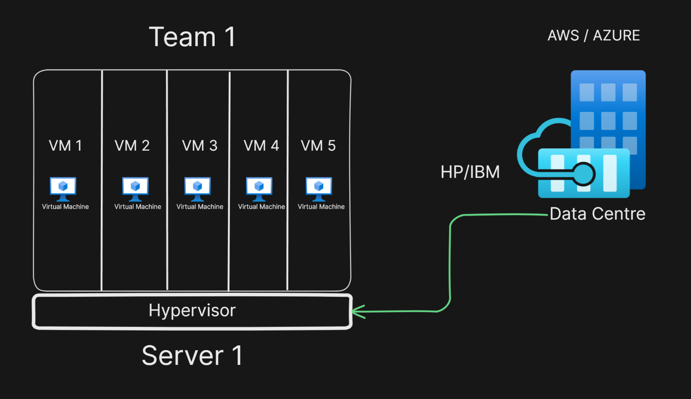

# Virtual Machines

#### Things that will be discussed
1. What is a Server?
2. Physical Vs Virtual
3. Hypervisor
4. How to create VM?
5. Real World Examples.

Imagine you own a large 1-acre plot of land, where you're living comfortably. One day, you realize you only need half of that land to live luxuriously, and the rest is going unused. Instead of letting that extra land sit idle, you decide to build another property on it and rent it out, generating additional income. This allows you to make the most of your available resources while maintaining your lifestyle. The tenants also benefit by getting a space to live, and you're efficiently using your land.

This analogy is very similar to how virtual machines (VMs) work in real-world software engineering, especially in application delivery.

Relating to Virtual Machines:
In computing, physical servers (just like your acre of land) often have more capacity than needed for a single application. Just like you don't need the entire land for yourself, a company doesn't always need the entire server’s resources to run one application.

Instead of wasting those resources, virtualization allows multiple virtual machines (like the additional property you built) to run on a single physical server. Each VM behaves as if it’s a separate machine, with its own operating system and applications, but all share the same underlying hardware. This way, companies can efficiently use their resources, running multiple applications or services on the same server, just like you're renting out the extra land to make more money.

### What is a Hypervisor
A *hypervisor* (also known as a virtual machine monitor) is software, firmware, or hardware that enables multiple virtual machines (VMs) to run on a single physical server by partitioning its resources (CPU, memory, storage). Each VM runs its own operating system, isolated from others, while sharing the underlying physical hardware.

Basically we do a `Logical Isolation` of the server that you rent from a provider(HP/IBM) in a VM using Hypervisor

#### Some Popular hypervisors are `VMWARE`, `Xen` etc

### How It Solves Real-World Problems:
    
    Cost Efficiency: Just as you're generating rental income, companies save money by using VMs to host multiple applications on fewer physical machines, reducing hardware and maintenance costs.

    Resource Optimization: Instead of leaving the server's resources idle (similar to unused land), virtualization allows for efficient use of computing power, storage, and memory, maximizing resource usage.

    Scalability: If you ever need more resources or space (just like if your family grew and you needed more of your land), you can adjust the number of VMs on the server, or scale the VMs to use more resources, depending on demand.

    Isolation and Security: Even though you're sharing land with tenants, both you and your tenants have private, independent spaces. Similarly, in a virtualized environment, VMs are isolated from each other, ensuring that one application doesn’t interfere with another. This improves security and reliability.

    Application Delivery:
    In a business context, when delivering applications to consumers (just like providing space for tenants), VMs allow companies to deploy applications faster, manage updates efficiently, and reduce downtime. With virtualization, servers can host multiple versions of an app or service, ensuring smooth delivery to end users, much like offering high-quality rental properties without disturbing your own living situation.

In summary, using virtual machines is like renting out unused land: it’s about maximizing efficiency, optimizing resources, and benefiting both you and others without compromising your own quality of life.

