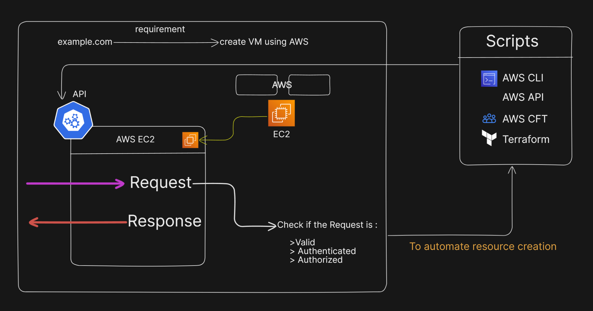

# How to create Virtual Machines using AWS or Azure

Let’s say you want to create virtual machines (VMs) on Amazon Web Services (AWS). Imagine your company needs to set up thousands of VMs, but manually creating each one would be time-consuming and inefficient. Instead of launching these VMs one by one, you’d want to automate this process.

AWS offers tools like the Amazon EC2 API, which allows you to script and automate tasks, such as launching, managing, and terminating instances. With this API, you can programmatically create all the VMs your company needs with just a few commands or scripts. This saves time, reduces manual effort, and ensures consistency across all the virtual machines you create.

In essence, instead of handling thousands of VMs manually, the EC2 API helps you scale quickly and efficiently by automating the entire process.

*So to automate this process we use many tools available* :

1. AWS CLI
2. AWS API (BOTO3)
3. AWS CFT(Cloud Formation Templates)
4. Terraform
5. AWS CDK(Cloud Development Kit)

#### ***For the Hybrid Cloud pattern `Terrafom` is preferred.***

## Creating VM using AWS
1. Make a aws amount.
2. Search for EC2 service in search box.
3. Click on Instances and then Launch Instances.
4. Fill you server Name and Select for any Quick Start (*preferred Ubuntu for begineers*).
5. Select Insatance Type (*Prefer a free tier*).
6. Create a Key-Value Pair.

    -  RSA
    -  .pem
    - Click on create key pair.
7. Click on Launch Instance.

## Creating VM using Azure

1. Sign-up with Github.

2. Click on Create Resource.
3. Click on Virtual Machine
    - Create
4. Provide the details.
