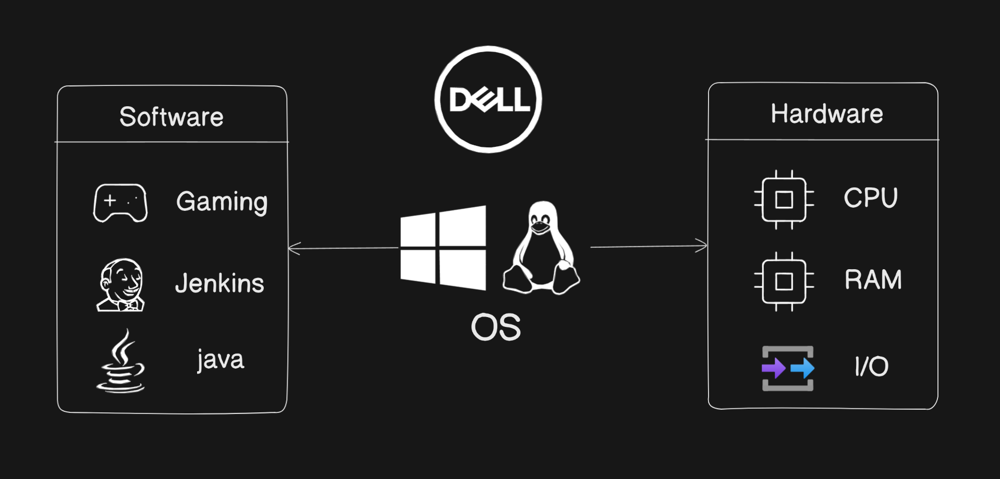

# Shell Scripting for Devops

### Linux is a OS which is widely use in the DevOps industry because it's a free open source, secure, contains a lot of distribution (Ubuntu, RedHat etc.) and fast.

# Architecture of Linux(OS)

1. **Kernel** : This is the heart of the OS as it is responsible for communicating with different software and doing the tasks.

    There are four important aspects of the kernel:

    - Device management
    - Memory management
    - Process management
    - Handling your system calls

2. **System Libraries** : They are responsible for performing a particular task. 
    
    Example: `libC`

**Not going into the details of it but these are the fundamentals of the OS.**