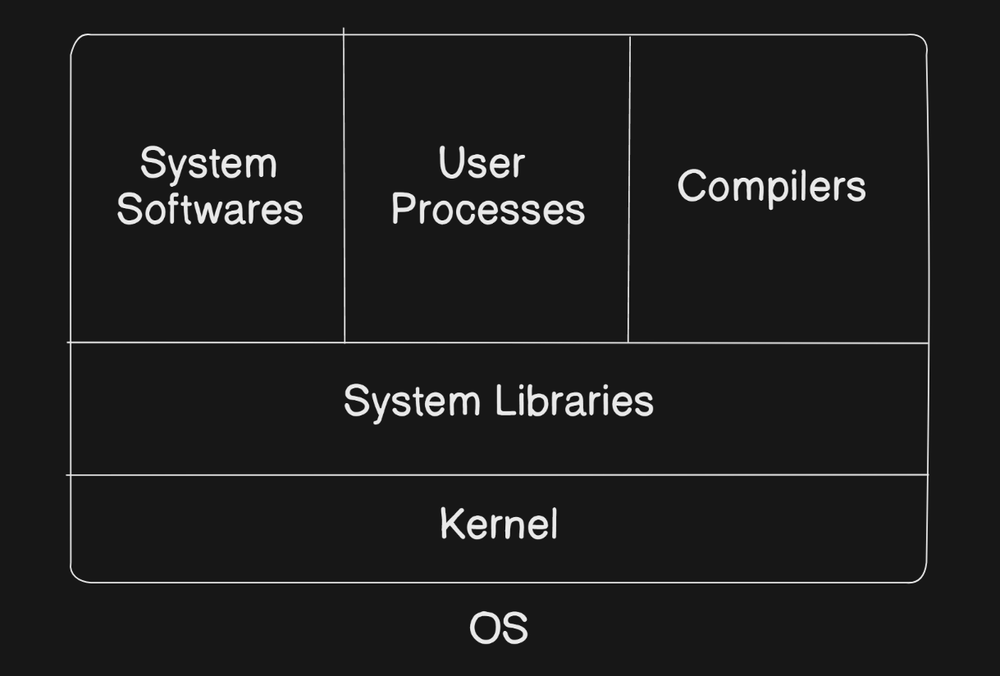

# Shell Scripting for Devops


### Linux is a OS which is widely use in the DevOps industry because it's a free open source, secure, contains a lot of distribution (Ubuntu, RedHat etc.) and fast.

# Architecture of Linux(OS)



1. **Kernel** : This is the heart of the OS as it is responsible for communicating with different software and doing the tasks.

    There are four important aspects of the kernel:

    - Device management
    - Memory management
    - Process management
    - Handling your system calls

2. **System Libraries** : They are responsible for performing a particular task. 
    
    Example: `libC`

**Not going into the details of it but these are the fundamentals of the OS.**


## Shell Scripting

Shell scripting lets you interact with the operating system via the command line, enabling automation and efficient task management.

## Basic Shell Commands

***Some commands that I know***:
- ls
- exa
- exa -la
- man <command>
- touch
- rm -rf
- rmdir
- mkdir
- vim 
- nvim
- cd 
- cat
- history


### 1. `free`
Displays the amount of free and used memory on your system.

### 2. `free -g`
Shows memory information in gigabytes (GB) for easier reading.

### 3. `nproc`
Displays the number of processing units (CPU cores) available.

### 4. `df -h`
Shows disk space usage for each filesystem in a "human-readable" format (like MB, GB).

### 5. `top`
Opens a real-time view of running processes, displaying CPU and memory usage for each.

**Ok so now let's move on to the shell scripting part**

1. You have to create a file in order to automate or do shell scripting, so for that write this in your terminal

```shell
    touch <file-name>.sh
```

*to start with the shell-scripting use this at starting `#!/` it's called **shebang.***

So basically we start a shell script by wirting this 

```shell

#!/bin/sh
or
#!/bin/ksh
or
#!/bin/bash
or 
#!/bin/dash
```

### Explanation of Shell Interpreter Directives

When writing shell scripts, the first line, known as the **shebang**, defines which shell interpreter should run the script.

### 1. `#!/bin/sh`
- **Purpose**: Uses the system's default shell, often linked to `bash` or `dash` on Linux.
- **Usage**: Provides a general shell environment, commonly used for simple scripts.

### 2. `#!/bin/ksh`
- **Purpose**: Specifies the KornShell (`ksh`) as the interpreter.
- **Usage**: Useful for scripts that rely on KornShell-specific features, often seen in legacy systems.

### 3. `#!/bin/bash`
- **Purpose**: Uses the Bourne Again Shell (`bash`).
- **Usage**: The most commonly used interpreter for Linux shell scripting, with extensive support and features.

### 4. `#!/bin/dash`
- **Purpose**: Specifies `dash`, a lightweight POSIX-compliant shell.
- **Usage**: Ideal for faster execution of basic scripts due to its simplicity and speed compared to `bash`.

Each of these options specifies a different shell interpreter, chosen based on the script's compatibility and the shell features required.


**Now you create a .sh file for let's suppose to print something**

```shell
#!/bin/bash

echo "Hello and Welcome to shell scripting."

```

So inorder to execute this file, do this:

```shell
sh <file-name>.sh

or

./<file-name>.sh

```

### Handling "Permission Denied" in Linux

If you encounter a `permission denied` error after running a command, it means Linux’s security settings are blocking access. To grant permission, you’ll need to use the `chmod` command, which is designed to modify permissions.

#### Understanding `chmod`

The `chmod` command operates with three main parts:
1. **User**: The root user or administrator.
2. **Group**: The group with access to the file or directory.
3. **Permissions**: The access rights for the user, group, and others.

By using `chmod`, you can specify who can read, write, or execute a file or directory.

#### Granting Permissions Using Numeric Codes

In Linux, you can assign permissions using numbers. Each number represents a specific permission:

- `4` for **Read** (`r`)
- `2` for **Write** (`w`)
- `1` for **Execute** (`x`)

You combine these numbers to set permissions for three categories in this order:
- **User** (owner)
- **Group** (group members)
- **Others** (everyone else)

For example:
- `chmod 755 filename` means:
  - User: `7` (Read + Write + Execute)
  - Group: `5` (Read + Execute)
  - Others: `5` (Read + Execute)

This command would grant full permissions to the user, and read and execute permissions to the group and others.
.
